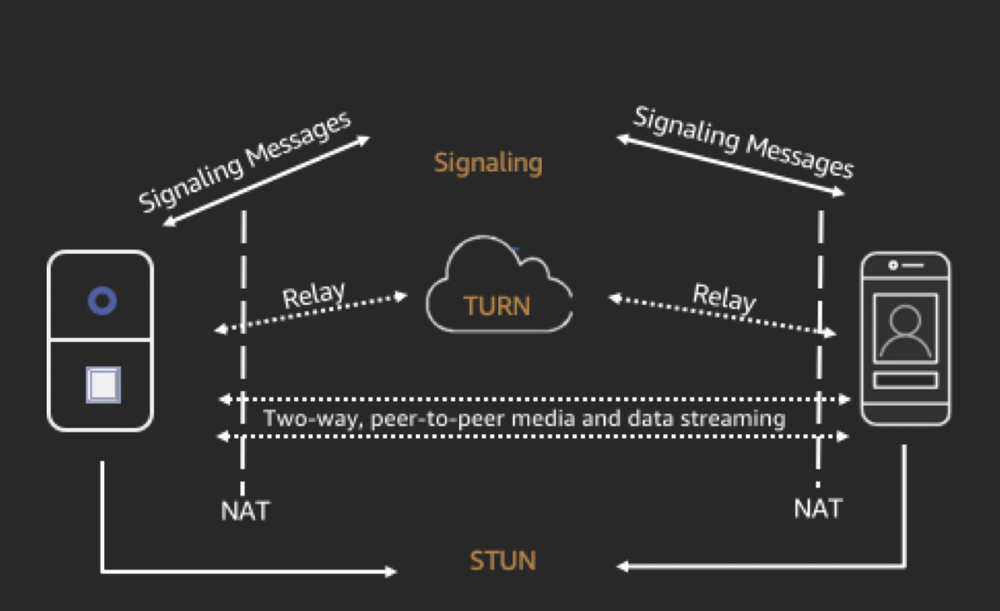

# Lab 1 - How it works

## How it works

Scenario: there are two peers, A and B, who are both using a WebRTC peer to peer two way media stream. Here is the flow when A’s application wants to connect B’s application.

To connect to B's application, A's application must generate an SDP offer. An SDP offer contains information about the session A's application wants to establish, including what codecs to use, whether this is an audio or video session, etc. It also contains a list of ICE candidates, which are the IP and port pairs that B's application can attempt to use to connect to A.
To build the list of ICE candidates, A's application makes a series of requests to a STUN server. The server returns the public IP address and port pair that originated the request. A's application adds each pair to the list of ICE candidates, in other words, it gathers ICE candidates. Once A's application has finished gathering ICE candidates, it can return an SDP.
Next, A's application must pass the SDP to B's application through a signaling channel over which these applications communicate. The transport protocol for this exchange is not specified in the WebRTC standard. It can be performed over HTTPS, secure WebSocket, or any other communication protocol.
Now, B's application must generate an SDP answer. B's application follows the same steps A used in the previous step: gathers ICE candidates, etc. B's application then needs to return this SDP answer to A's application.
After A and B have exchanged SDPs, they then perform a series of connectivity checks. The ICE algorithm in each application takes a candidate IP/port pair from the list it received in the other party's SDP, and sends it a STUN request. If a response comes back from the other application, the originating application considers the check successful and marks that IP/port pair as a valid ICE candidate.
After connectivity checks are finished on all of the IP/port pairs, the applications negotiate and decide to use one of the remaining, valid pairs. When a pair is selected, media begins flowing between the application.
If either of the applications can't find an IP/port pair that passes connectivity checks, they'll make STUN requests to the TURN server to obtain a media relay address. A relay address is a public IP address and port that forwards packets received to and from the application to set up the relay address. This relay address is then added to the candidate list and exchanged via the signaling channel.

## AWS KVS WebRTC Technology Concepts and Key Terms

1. Session Traversal Utilities for NAT (*STUN*).

*A protocol that is used to discover your public address and restrictions in your router that would prevent a direct connection with a peer.*

2. Traversal Using Relays around NAT (*TURN*).

*A protocol that is used to bypass the Symmetric NAT restriction by opening a connection with a TURN server and relaying all information through that server.*

3. Session Description Protocol (*SDP*).

*A standard for describing the multimedia content of the connection such as resolution, formats, codecs, encryption, etc. so that both peers can understand each other once the data is transferring.*

4. SDP Offer.

*An SDP message sent by an agent which generates a session description in order to create or modify a session. It describes the aspects of desired media communication.*

5. SDP Answer.

*An SDP message sent by an answerer in response to an offer received from and offer. The answer indicates the aspects that are accepted. For example, if all the audio and video streams in the offer are accepted.*

6. Interactive Connectivity Establishment (*ICE*).

*A framework that allows your web browser to connect with peers.*

7. ICE Candidate.

*A method that the sending peer is able to use to communicate.*

## Next

Move to [Lab 2 - Building Amazon KVS WebRTC C SDK on Raspberry Pi 4 with Raspberry Pi Camera]({{ "/lab/lab-2" | absolute_url }})
