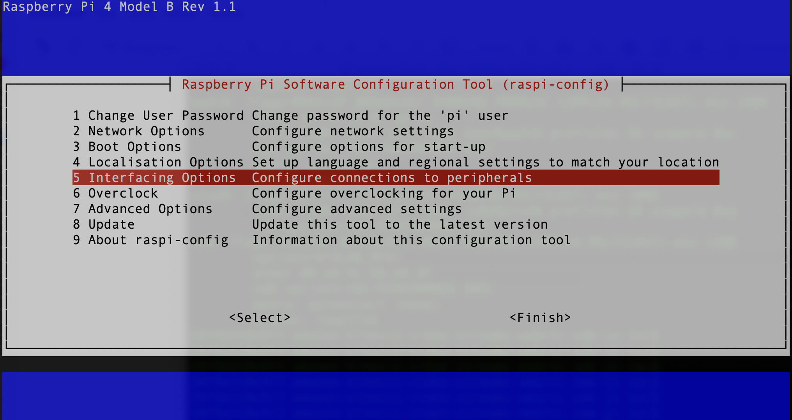
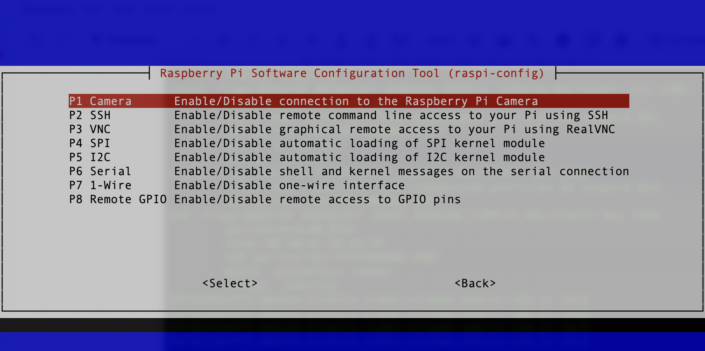
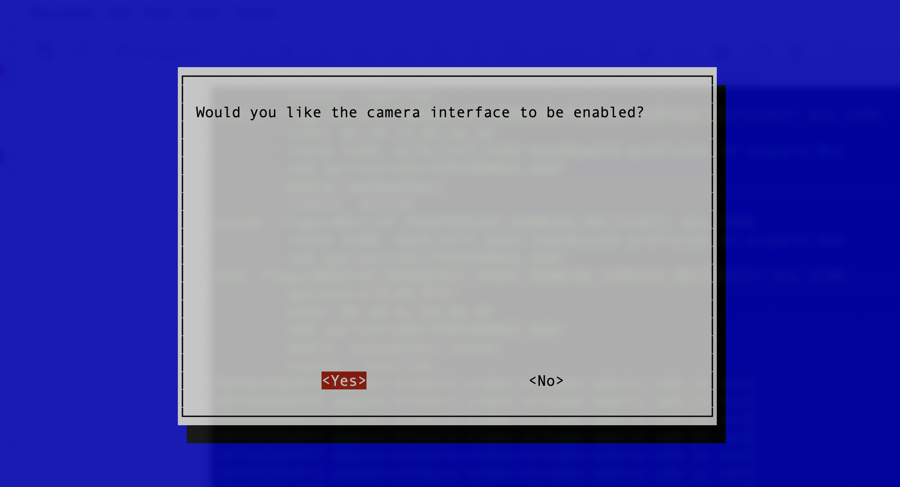
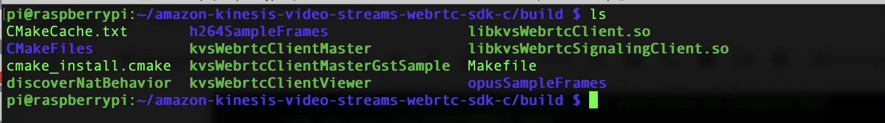

# Building Amazon KVS WebRTC C SDK on Raspberry Pi 4 with Raspberry Pi Camera

## Prerequisites

Hardware requirements:

1. Raspberry Pi 4 platform
2. Raspberry Pi Camera and cable
3. An SD card, 32GB or higher is recommended

Software requirements:

1. [Raspberry Pi OS](https://www.raspberrypi.org/downloads/raspberry-pi-os/)
2. [Amazon KVS WebRTC C SDK](https://github.com/awslabs/amazon-kinesis-video-streams-webrtc-sdk-c)
3. Optional: Gstreamer for live view from Raspberry Pi Camera

## Configure your Raspberry Pi 4

Quick setup of Raspberry Pi 4, we assume that you are familiar with Linux commands and you can login via ssh connection.

1. Download Raspberry Pi OS from the link and flash it to your SD card.
2. Connect your Raspberry Pi Camera to Raspberry Pi 4 via cable.
3. Plug the SD card to Raspberry Pi 4 and boot.
4. Make sure you have Internet connection.
5. Run the command `sudo raspi-config` and follow the steps to configure Raspberry Pi Camera. Save and reboot:

    

    

    
6. Install the related software packages to compile the Amazon KVS WebRTC C SDK.
    ```bash
    sudo apt install -y cmake g++ pkg-config gstreamer1.0-tools libgstreamer1.0-dev libgstreamer-plugins-base1.0-dev gstreamer1.0-plugins-ugly
    sudo apt install -y libssl-dev libcurl4-openssl-dev liblog4cplus-1.1-9 liblog4cplus-dev libcap-dev
    ```
## Download and build Amazon KVS WebRTC C SDK

1. Login to Raspberry Pi 4 and follow the steps to download and build Amazon KVS WebRTC C SDK.
    ```bash
    cd ~
    git clone --recurse https://github.com/awslabs/amazon-kinesis-video-streams-webrtc-sdk-c.git
    mkdir -p amazon-kinesis-video-streams-webrtc-sdk-c/build
    cd amazon-kinesis-video-streams-webrtc-sdk-c/build
    #It will take a while to run cmake
    cmake ..
    make -j4
    ```

2. If every step goes smoothly, you should see the following binary file and libraries:
    

## Next

Move to [Lab 3 - Quick start KVS WebRTC with IAM user]({{ "/lab/lab-3" | absolute_url }})
