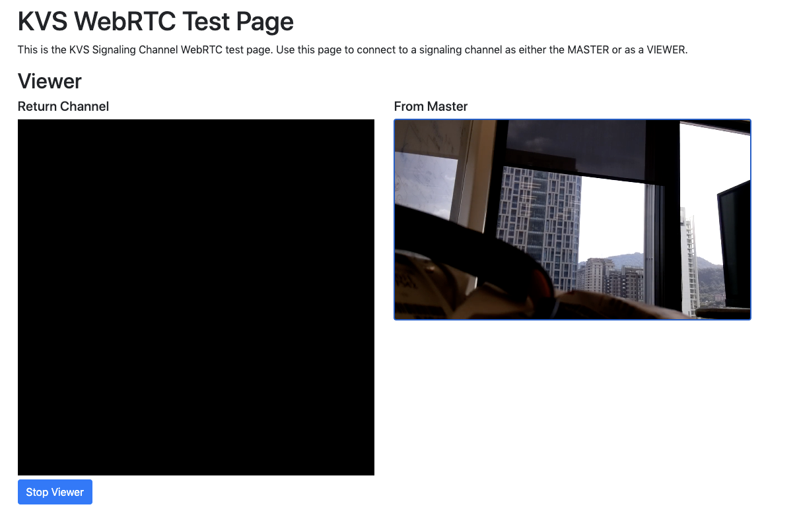

# Quick start KVS WebRTC with IAM user

A quick way to run and view the audio/video stream is to use Amazon IAM user. Please follow the steps to create a valid AWS user to access Amazon KVS WebRTC service.

1. Login to [AWS console](https://aws.amazon.com/) and search IAM to login. 
2. Click **Add user**. 
3. Giving a User name and check the **Programmatic access**. 
4. Choose **Attach existing policies directly** and search **AmazonKinesisVideoStreamsFullAccess**. 
5. Click **Next:Tags** and do nothing. Then click **Next:Review**. 
6. In Review page, click **Create user**. You should see your **Access key ID** and **Secret access key** now. Please download the csv file and keep it securely. 
7. Follow the steps to configure Amazon KVS WebRTC and run it.
    ```bash
    #Use the access key ID and secret access key you created above.
    #If you don't setup the region, the defualt region will be us-west-2.
    export AWS_DEFAULT_REGION=your_desired_region
    export AWS_SECRET_ACCESS_KEY=your_secret_access_key
    export AWS_ACCESS_KEY_ID=your_access_key_id
    #Optional, to configure debug level. The level is 1 (VERBOSE) t0 7 (SLIENT).
    export AWS_KVS_LOG_LEVEL=1

    #Make sure your system time is up-to-date. Or you should sync it manually.
    date

    cd ~/amazon-kinesis-video-streams-webrtc-sdk-c/build
    #To run Amazon KVS WebRTC stream local file to the viewer side
    ./kvsWebrtcClientMaster your_desired_channel_name
    ```
8. Use the following link to view the stream: https://awslabs.github.io/amazon-kinesis-video-streams-webrtc-sdk-js/examples/index.html. Note that this page only works without issue with Google Chrome browser and you should have camera on the same machine. Fill the same information from your IAM user with **access key ID, secret access key and channel name**. Then click **Start Viewer**.  
9. To play live stream with Raspberry Pi Camera, follow the steps to run.
    ```bash
    cd ~/amazon-kinesis-video-streams-webrtc-sdk-c/build
    ./kvsWebrtcClientMasterGstSample your_desired_channel_name
    ```
10. Use the same link to play live view. 

## Next

Move to [Lab 4 - Connect Amazon KVS WebRTC with AWS IoT]({{ "/lab/lab-4" | absolute_url }})
