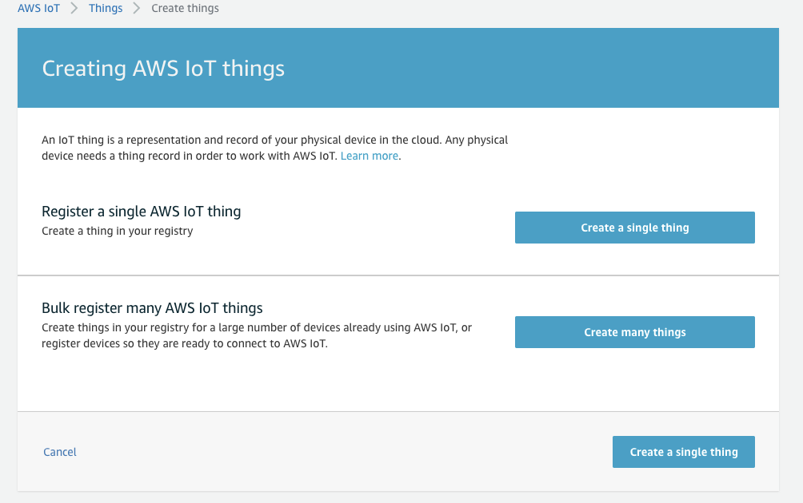

# Connect Amazon KVS WebRTC with AWS IoT

We just test Amazon KVS WebRTC with IAM user but it is not recommended. With AWS IoT Thing credentials, it can be managed more securely. To use AWS IoT credential, you need to create an Amazon IAM role to grant your policy.

## Create an IAM role

1. Login to AWS IAM console, click Roles and then click **Create role**. 
2. In **Select type of trusted entity**, choose **AWS service**. In **Choose a use case**, choose **Kinesis**. In **Select your use case**, choose **Kinesis Analytics** then click **Next: Permissions**. Note that: this is the temporary solution from AWS IAM console to create an empty role. You can use the AWS Command Line Interface (AWS CLI)to do it as well.  
3. Leave everything as default and click **Next:Tags**. Also leave everything as default in **Add tags(optional)** page then click **Next: Review**. 
4. Give your role a name and delete everything in **Role description**. Once you finish, click **Create role**. 
5. Search the role you just created above and click it to configure. 
6. In **Permissions tab**, click **Add inline policy**. 
7. Click **JSON** tab, copy the following JSON content and paste it. Next you can click **Review policy**. Note that if you do not want to have an access right to create Amazon KVS WebRTC Signaling Channel, you can remove line `kinesisvideo:DescribeSignalingChannel` in the following JSON.
    ```json
    {
        "Version": "2012-10-17",
        "Statement": [
            {
                "Effect": "Allow",
                "Action": [
                    "kinesisvideo:DescribeSignalingChannel",
                    "kinesisvideo:CreateSignalingChannel",
                    "kinesisvideo:GetSignalingChannelEndpoint",
                    "kinesisvideo:GetIceServerConfig",
                    "kinesisvideo:ConnectAsMaster"
                ],
                "Resource": "arn:aws:kinesisvideo:*:*:channel/${credentials-iot:ThingName}/*"
            }
        ]
    }
    ```
    
8. Give this policy a name and click **Create policy**. 
9. After the step 8, you will redirect back to the page of role you created above. In **Trust relationships**, click **Edit trust relationship**. 
10. Copy and paste the following JSON content then click **Update Trust Policy**. 
    ```json
    {
        "Version": "2012-10-17",
        "Statement": [
            {
            "Effect": "Allow",
            "Principal": {
                "Service": "credentials.iot.amazonaws.com"
            },
            "Action": "sts:AssumeRole"
            }
        ]
    }
    ```
    

## Create an AWS IoT Thing and configure

You can use AWS IoT Thing Name as Signaling Channel Name and AWS IoT Certificate ID as Signaling Channel Name. The example here is to use AWS IoT Thing Name as Signaling Channel Name, including IAM Role you created above.

1. Login to AWS IoT Core console. You can search it in AWS Management Console: https://aws.amazon.com/. Click **Manage** and choose **Types** then click **Create**. If it is the first time you want to create a thing type, choose **Create a thing type**.  
2. Give a name and leave everything else as default then click **Create thing type**. 
3. Click **Manage** and choose Things then click **Create**. If it is the first time you want to create a thing, choose **Register a thing**.  
4. Choose **Create a single thing**. 
5. Give a name and choose the type you created above then click **Next**. 
6. Choose **One-click certificate (recommended)** and click **Create certificate**. 
7. Download three files including certificate, public key and private key. Click **Activate** then click **Done**. We will attach policy later. 
8. In Secure, choose **Role Aliases** and click **Create**. If it is the first time you want to create a thing, choose **Create role alias**.  
9. Give a name and choose the IAM role you created above in **Select role to alias** then click **Create role alias**. 
10. In **Secure**, choose **Policies** then click **Create**. If it is the first time you want to create a AWS IoT policy, choose **Create a policy**.  
11. Give a name and choose **Advanced mode**. 
12. Copy the following JSON content and paste then click **Create**. Note that: you need to fill `your_region`, `your_id` and `your_policy_alias` with your own information. You can find your_region and your_id in thing information you created above. And `your_policy_alias` is the alias you created above.
    ```bash
    {
        "Version": "2012-10-17",
        "Statement": [
            {
            "Effect": "Allow",
            "Action": [
                "iot:Connect"
            ],
            "Resource": "arn:aws:iot:your_region:your_id:rolealias/your_policy_alias"
            },
            {
            "Effect": "Allow",
            "Action": [
                "iot:AssumeRoleWithCertificate"
            ],
            "Resource": "arn:aws:iot:your_region:your_id:rolealias/your_policy_alias"
            }
        ]
    }
    ```
     
13. In **Manage**, choose **Things** and click the thing you created above. 
14. Click **Security** then click the certificate you created above. 
15. Click **Policies** and drop down the **Actions** on top-left side then click **Attach policy**. 
16. Search the policy you created above then click **Attach**. 

## Modify your code and rebuild

To adopt AWS IoT Credential to connect Amazon KVS WebRTC service, you should modify the related codes.

1. Copy the thing credential files to your Raspberry Pi 4.
    ```bash
    scp ~/Downloads/xxxxxxx-certificate.pem.crt pi@your_RPi_IP:~/Downloads/
    scp ~/Downloads/xxxxxxx-private.pem.key pi@your_RPi_IP:~/Downloads/
    scp ~/Downloads/xxxxxxx-public.pem.key pi@your_RPi_IP:~/Downloads/
    ```

2. Login to Raspberry Pi 4 and following the instructions to modify code.
    ```bash
    cd ~/amazon-kinesis-video-streams-webrtc-sdk-c/
    #Use your familiar editor to modify code
    vim.tiny samples/Common.c
    ```

3. Search the function `createStaticCredentialProvider` and comment the whole lines out.
    ```bash
        CHK_STATUS(lookForSslCert(&pSampleConfiguration));
    
        // Set the logger log level
        if (NULL == (pLogLevel = getenv(DEBUG_LOG_LEVEL_ENV_VAR)) || (STATUS_SUCCESS != STRTOUI32(pLogLevel, NULL, 10, &logLevel))) {
            logLevel = LOG_LEVEL_WARN;
        }
    
        SET_LOGGER_LOG_LEVEL(logLevel);
    
        //CHK_STATUS(
        //    createStaticCredentialProvider(pAccessKey, 0, pSecretKey, 0, pSessionToken, 0, MAX_UINT64, &pSampleConfiguration->pCredentialProvider));
    ```

4. Add the following lines after step 2. 
    ```bash
    SET_LOGGER_LOG_LEVEL(logLevel);
    
        //CHK_STATUS(
        //    createStaticCredentialProvider(pAccessKey, 0, pSecretKey, 0, pSessionToken, 0, MAX_UINT64, &pSampleConfiguration->pCredentialProvider));
    
        //Tec add for IoT
        CHK_STATUS(
            createLwsIotCredentialProvider(
                "cxxxxxxx.credentials.iot.ap-northeast-1.amazonaws.com",  // IoT credentials endpoint
                "/home/pi/Downloads/xxxxxxx-certificate.pem.crt",  // path to iot certificate
                "/home/pi/Downloads/xxxxxxx-private.pem.key", // path to iot private key
                "/home/pi/amazon-kinesis-video-streams-webrtc-sdk-c/certs/cert.pem", // path to CA cert
                "your_policy_alias", // IoT role alias
                channelName, // iot thing name, recommended to be same as your channel name
                &pSampleConfiguration->pCredentialProvider));
    ```

5. Search the function “freeStaticCredentialProvider” and comment the whole line out. Add a line as below.
    ```bash
     if (IS_VALID_CVAR_VALUE(pSampleConfiguration->cvar)) {
            CVAR_FREE(pSampleConfiguration->cvar);
        }
    
        //freeStaticCredentialProvider(&pSampleConfiguration->pCredentialProvider);
    
        //Tec add for releasing
        freeIotCredentialProvider(&pSampleConfiguration->pCredentialProvider);
    ```

6.  Recompile and run it. Check the video stream using the same test web page above.
    ```bash
    cd build
    make -j4
    #....
    #....
    #You can export your AK/SK to whatever value to verify.
    ./kvsWebrtcClientMaster your_thing_name
    ```
## Next

Move to [Lab 5 - Cross Compile For Other Platforms]({{ "/lab/lab-5" | absolute_url }})
